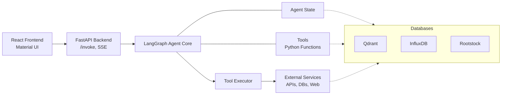

# DeFi Deep Research Agent

**Tagline:** AI-Powered Deep DeFi Research & Strategy.


## Overview

This project implements an AI-powered research agent designed to tackle the complexities of researching decentralized finance (DeFi). Gathering information about protocols, tokens, strategies, and risks is often time-consuming and fragmented across various sources. This agent automates the process by autonomously planning and executing research tasks using a suite of specialized tools, delivering personalized insights based on user profiles.

## The Problem It Solves

Researching DeFi involves navigating:

*   **Information Overload:** Data is scattered across protocol docs, APIs, block explorers, news sites, social media, and audit reports.
*   **Complexity:** Understanding tokenomics, smart contracts, yield sources, and market trends requires diverse data interpretation.
*   **Lack of Personalization:** Standard research often ignores individual risk tolerance, portfolio context, or preferred networks.
*   **Tedious Manual Work:** Gathering and synthesizing information manually is slow and prone to missing key details.

## How This Agent Helps

The DeFi Deep Research Agent acts as an intelligent assistant by:

*   **Automating Data Gathering:** Uses tools to fetch data from APIs (DefiLlama, CoinGecko), scrape websites/Google search results (`browser-use`), parse documents (Upstage AI), query databases (Qdrant, InfluxDB), and interact with blockchains (Rootstock via `goat-sdk`).
*   **Structured Research:** Employs LangGraph to create multi-step plans, ensuring methodical investigation tailored to the user's query.
*   **Personalization:** Incorporates user profiles (risk tolerance, preferred chains) into planning and analysis for relevant results.
*   **Enhanced Safety Awareness:** Can be directed to search for audits and considers user risk profiles.
*   **Efficiency:** Significantly reduces the manual effort needed for DeFi research.

## Features

*   **Multi-Step Planning:** Uses LangGraph to dynamically plan research tasks.
*   **Extensible Tool Suite:** Integrates various tools for data acquisition:
    *   `defi_llama_api_tool`: Fetches protocol data (TVL, etc.).
    *   `coingecko_api_tool`: Fetches token market data.
    *   `google_search_links_tool`: Gets top Google search result URLs.
    *   `scrape_tool_direct`: Scrapes content from specific URLs (`browser-use`).
    *   `document_parser`: Parses local PDFs/documents (Upstage AI).
    *   `vfat_scraper_tool`: Experimental farm data scraping (`browser-use`).
    *   `onchain_tx_history_tool`: Fetches address transaction history (RSK Testnet).
    *   `time_series_retriever`: Queries historical data (InfluxDB).
    *   `send_ethereum`: Sends native tokens on configured chain (Rootstock via `goat-sdk`).
    *   `portfolio_retriever`: (Placeholder/Basic) Fetches user portfolio data.
*   **Vector Store Integration:** Stores processed data (scraped content, documents) in Qdrant for semantic retrieval during analysis.
*   **Time-Series Database:** Stores time-series data (prices, TVL - *if populated*) in InfluxDB.
*   **Streaming API:** FastAPI backend streams agent progress and results to the frontend via Server-Sent Events (SSE).
*   **Interactive Frontend:** React frontend displays the agent's progress, plan, tool results, analysis, and allows for interaction (e.g., resuming paused flows).
*   **Soneium Integration:** Configured wallet interaction via `goat-sdk` allows for transactions on the Rootstock network (Testnet configured).

## Architecture




## Technology Stack

*   **Backend:** Python, FastAPI, LangChain, LangGraph, Pydantic, Uvicorn, asyncio
*   **AI/LLM:** Google Generative AI (Gemini)
*   **Tools/Libs:** `browser-use`, `requests`, `langchain-upstage`, `web3.py`, `goat-sdk`
*   **Databases:** Qdrant (Vector Store), InfluxDB (Time-Series)
*   **Frontend:** React, TypeScript, Material UI
*   **Blockchain:** Rootstock (Testnet for wallet interactions)
*   **Communication:** Server-Sent Events (SSE)

## Setup & Installation

**Prerequisites:**

*   Python 3.9+
*   Node.js and npm (or yarn)
*   Git
*   Access to running Qdrant and InfluxDB instances (local or cloud).
*   Access to Google AI (Gemini API Key).
*   Access to Upstage AI (API Key).
*   Funded wallet on Rootstock Testnet.

**Installation Steps:**

1.  **Clone the Repository:**
    ```bash
    git clone <your-repository-url>
    cd <your-repository-name>
    ```

2.  **Configure Environment Variables:**
    *   Navigate to the `backend` directory: `cd backend`
    *   Create a `.env` file by copying the example (if one exists) or creating it manually.
    *   Add the following required variables:
        ```dotenv
        # backend/.env
        GOOGLE_API_KEY="your_google_gemini_api_key"
        UPSTAGE_API_KEY="your_upstage_api_key"

        # Wallet Configuration (Ensure this key is funded on Rootstock Testnet)
        WALLET_PRIVATE_KEY="0xyour_private_key_here"
        ROOTSTOCK_RPC_URL="https://public-node.testnet.rsk.co" # Or your preferred node

        # Database Configuration
        QDRANT_URL="http://localhost:6333" # Or your Qdrant instance URL
        # QDRANT_API_KEY="your_qdrant_api_key" # Add if authentication is enabled

        INFLUXDB_URL="http://localhost:8086" # Or your InfluxDB instance URL
        INFLUXDB_TOKEN="your_influxdb_token"
        INFLUXDB_ORG="your_influxdb_org"
        INFLUXDB_BUCKET="your_influxdb_bucket"

        # Optional: Twitter API (if using the tool)
        # TWITTER_BEARER_TOKEN="your_twitter_bearer_token"
        ```
    *   These variables are typically loaded in `backend/config.py`.

3.  **Install Backend Dependencies:**
    ```bash
    cd backend
    # Create/activate a virtual environment (recommended)
    # python -m venv venv
    # source venv/bin/activate # or venv\Scripts\activate on Windows
    pip install -r requirements.txt
    # Ensure browser-use is installed if not in requirements.txt
    # pip install browser-use
    ```

4.  **Install Frontend Dependencies:**
    ```bash
    cd ../frontend
    npm install
    # or yarn install
    ```

5.  **Database Setup:**
    *   **Qdrant:** Ensure your Qdrant instance is running. The agent will attempt to create the specified collection (`RESEARCH_COLLECTION` in `config.py`) if it doesn't exist.
    *   **InfluxDB:** Ensure your InfluxDB instance is running and accessible at the configured URL/Token/Org. You need to manually create the specified bucket (`INFLUXDB_BUCKET`) via the InfluxDB UI or CLI.

6.  **Wallet Setup:** Make sure the wallet corresponding to the `WALLET_PRIVATE_KEY` has sufficient test RBTC on the Rootstock Testnet (`ROOTSTOCK_RPC_URL`) to pay for gas fees for `send_ethereum` transactions.

## Running the Application

1.  **Start the Backend Server:**
    ```bash
    cd backend
    # Ensure virtual environment is active if you created one
    uvicorn main:app --host 0.0.0.0 --port 8000 --reload
    ```
    *(Adjust host/port as needed)*

2.  **Start the Frontend Development Server:**
    ```bash
    cd ../frontend
    npm run dev
    # or yarn dev
    ```

3.  **Access the Application:** Open your web browser and navigate to `http://localhost:5173` (or the port specified by the frontend server, often 3000 or 5173).

## API Endpoints

*   `POST /api/invoke`: Starts a new research agent run with a user query and optional profile. Streams results via SSE.
*   `POST /api/resume`: Resumes a paused agent run using a `thread_id` and optional feedback. Streams results via SSE.
*   `GET /api/openapi.json`: Provides the OpenAPI specification.
*   `GET /api/docs`: Interactive API documentation (Swagger UI).

## Configuration

*   **Environment Variables:** Managed via the `.env` file in the `backend` directory.
*   **Core Settings:** Application settings (database names, models, etc.) are defined in `backend/config.py`.
*   **Agent Prompts:** Prompts for the Planner, Analyzer, Strategist, and Replanner are located in `backend/prompts.py`.
*   **Tools:** Tool implementations are in `backend/tools/`, registration and schemas are in `backend/tools/__init__.py` and `backend/schemas.py`.

## Future Enhancements

*   Implement the `portfolio_retriever` tool fully.
*   Add a `deploy_contract` tool.
*   Implement the `time_series_retriever` tool.
*   More sophisticated error handling and retry logic for tools.
*   UI improvements for displaying complex data (charts, tables).
*   Add support for more blockchains and DeFi protocols.
